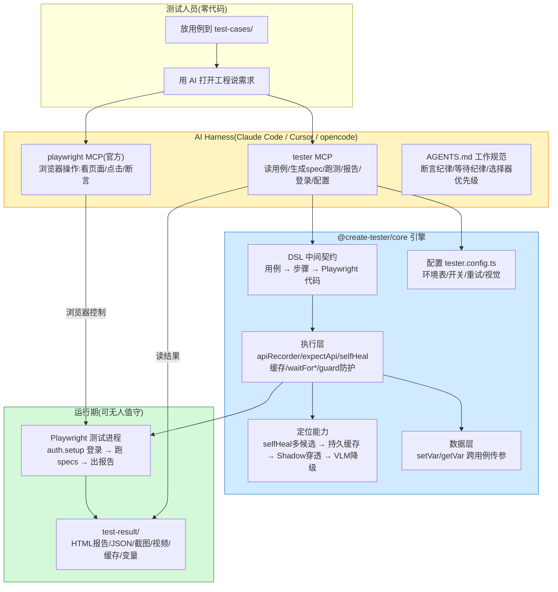

# create-tester

**tester 一体化包**:脚手架(`npm create tester`)+ 引擎(`tester` CLI / 接口断言 API / MCP 工具服务器)。

面向测试工程师的 **AI 驱动页面测试**。**常规回归场景**:放用例、说需求、报账号/地址,AI 通过 MCP 全自动完成(读用例、看页面、写 spec、跑测试、判失败根因),测试人员不写代码、不碰选择器。**复杂场景(验证码、环境清理、自定义组件)可能需要少量代码**,底层仍是 Playwright,AI 负责编排与回归闭环。

## 定位 / 和市面上的区别

市面上做"AI 能碰浏览器"的多,**做"让测试人员不用懂浏览器"的少,咱们是后者**:

| 维度 | @playwright/mcp | Mabl / Testim | **create-tester** |
| --- | --- | --- | --- |
| 用例解析(xlsx/xmind 零重写) | ❌ | 部分 | ✅ `convert_case` |
| 浏览器控制(browser_snapshot 等,官方 @playwright/mcp) | ✅ | ✅ | ✅ |
| 回归资产(`tests/*.spec.ts`) | ❌ | 部分 | ✅ |
| 失败根因 + stdout/stderr 透出 | ❌ | 有但贵 | ✅ 轻量 |
| 登录/验证码编排 | ❌ | 部分 | ✅ |
| 环境可复跑 | ❌ | ✅ | ✅ `env_reset` |
| 接口自动断言(免 waitForResponse) | ❌ | ❌ | ✅ `expectApi` |
| 长链路传参(创建→查询→编辑) | ❌ | 部分 | ✅ `setVar`/`extractField` |
| 选择器持久缓存 / 定位自愈 | ❌ | ❌ | ✅ `selfHeal` + 缓存 |
| 弹窗/遮罩/登录失效全局防护 | ❌ | 部分 | ✅ 骨架自动注入 |
| Shadow DOM 穿透定位 | ✅ | ✅ | ✅ `clickInShadow` 等 |
| 测试人员零负担(只聊天) | ❌(面向开发者) | 中 | ✅ |
| 成本 | 免费 | 订阅制 | 免费 |

**一句话**:@playwright/mcp 给 AI 一双浏览器的手,我们给测试工程师一个 AI 测试工位——用例解析 → 生成 → 回归 → 根因 → 环境还原,全闭环、自包含、免费。

## 测试人员体验(三步走)

1. **放用例**:把已有用例(Excel / XMind / Markdown / CSV / TXT)丢进 `test-cases/`,零重写
2. **说需求**:用支持项目级 MCP 的 AI(Claude Code / Cursor / opencode)打开工程,直接说"把 test-cases/登录.xlsx 转成测试用例跑一遍,失败的给我分析根因"
3. **报账号/地址**:对话里说"账号 xxx、密码 xxx"、"被测地址是 http://xxx:5173",AI 自动处理,测试人员不碰任何文件

验证码登录首次跑一次 `npm run login` 手动登录,之后自动复用;回归 `npm run test` 不需要 AI/MCP。

## 架构总览



> 流程:`tester_convert_case` 读用例 → `browser_snapshot`/`browser_find` 看页面 → `tester_generate_spec` 生成 spec(DSL 自动生成操作+断言)→ `tester_run_tests` 后台跑 → `tester_status`/`tester_failures` 看结果。固化后 `npm run test` 无人值守即可回归。

## 安装 / 快速开始

```bash
# 方式一:npm create(推荐,无需全局安装,交互式)
npm create tester@latest

# 方式二:npx(直接指定项目名)
npx create-tester@latest my-test

# 方式三:全局安装后直接用 create-tester 命令
npm i -g create-tester
create-tester my-test
```

生成后:

```bash
cd my-test && npm install     # 自动装依赖 + 自动下载浏览器
npm run test                  # 跑回归(playwright test,不用开 AI)
```

生成的测试工程**内核由 `@create-tester/core` 依赖提供**,模板只含配置与业务脚本(升级 = `npm update @create-tester/core`);脚手架自动生成 `.mcp.json`(双 MCP server:官方 playwright + tester),支持项目级 MCP 的 AI 打开工程即自动连接。

## 命令行

```
create-tester                 # 脚手架:建测试项目
create-tester upgrade         # 升级当前工程到最新引擎(更新 @create-tester/core 依赖,在工程根目录跑)
tester init                   # 初始化目录规范(幂等)
tester run                    # 运行测试(透传 playwright test)
tester mcp                    # 启动 MCP stdio server,打印可粘贴配置
tester diag                   # 诊断环境(依赖/配置/目录/MCP 握手)
tester view                   # 启动只读 Web 结果面板(展示 test-result,自动刷新)
tester install-browsers       # 安装 Playwright 浏览器(postinstall 自动调用)
```

> 所有命令支持 `--help`(如 `create-tester --help`、`tester mcp --help`)、`--version`。

## 多环境 & CI/CD

**多环境**:`tester.config.ts` 的 `envs` 表维护各环境地址,`defaultEnv` 决定默认跑哪个(缺省 test)。`tester run --env uat` 或 `TESTER_ENV=uat` 自动切到对应环境;不指定环境时自动用 `defaultEnv` 的地址(显式 `BASE_URL` 永远最高优先级)。账号密码走 `tests/_login.ts` + `TESTER_ACCOUNT`。

```bash
tester run --env test             # 跑 test 环境
tester run --env uat --workers 4  # 跑 uat 环境、4 并行
tester run --grep @smoke          # 只跑冒烟标签
```

**CI/CD**:`tester run` 退出码按结果(0=全通过,1=有失败),流水线可直接判红。模板自带 `ci.example.yml`(GitHub Actions 示例:装依赖 → 装浏览器 → 跑回归 → 传报告),复制为 `.github/workflows/regression.yml` 并配好 Secrets 即可;Jenkins/其他流水线同理,核心就是 `npx tester run --workers N`。

## 升级

- **脚手架本身**:全局装的可 `npm i -g create-tester@latest`;用 `npm create`/`npx` 的每次都自动用最新版,不用手动升。
- **已建的测试工程**(内核是 `@create-tester/core` 依赖):在工程根目录跑
  ```bash
  npx create-tester@latest upgrade
  ```
  执行 **`npm install @create-tester/core@latest`**(依赖版本管理),更新内核;**不覆盖任何你改过的文件**(`_login.ts`、`auth.setup.ts`、`playwright.config.ts`、specs、`env-reset.cjs`)。升级后重启 AI 会话即可。

## 登录(Playwright 官方模式 + 验证码编排)

- `tests/auth.setup.ts` 跑测试前登录一次存 `test-result/auth.json`,**整轮只登录一次**,所有用例复用 storageState
- 账号密码:测试人员在对话里说,AI 填进 `tests/_login.ts`,测试人员不碰文件
- **验证码/短信**:`login` 工具后台弹浏览器人工登录一次 → `login_status` 轮询 `auth.json` 生成 → 自动继续;或首次 `npm run login`

## 接口自动断言(核心差异化)

spec 直接 import `@create-tester/core`,页面操作触发的接口自动捕获,按 URL 关键字断言,不用手写 `waitForResponse`:

```ts
import { apiRecorder, expectApi } from '@create-tester/core';

test('登录成功', async ({ page }) => {
  const api = apiRecorder(page);
  await page.getByTestId('username').fill('test01');
  await page.getByTestId('login-submit').click();

  await expectApi(api, '/api/login').code('0');           // 业务码
  await expectApi(api, '/api/login').field('data.token').notEmpty(); // 字段
  await expectApi(api, '/api/login').status(200);         // 状态码
});
```

`@create-tester/core` 还提供:
- **智能等待** `waitForVisible`/`waitForClickable`/`waitForText`/`waitForURL`,替代硬编码延时
- **字段断言扩展** `matches`/`containsValue`/`between`
- **自愈定位 + 持久缓存** `selfHeal` 命中后写入 `test-result/locator-cache.json`,下次同页直接读缓存不重复探测(`TESTER_LOCATOR_CACHE=0` 关闭);`tester_cache_stats` 看命中率
- **跨用例变量系统** `setVar`/`getVar`/`extractField`,支撑「创建→查询→编辑」长链路(用例A提取 orderId,用例B复用)
- **全局防护** `installPageGuard`(弹窗自动 accept)/`waitMaskGone`(loading 遮罩)/`isLoggedOut`(登录失效检测),骨架自动注入
- **Shadow DOM 适配** `clickInShadow`/`fillInShadow`/`hasTextInShadow`,递归穿透 open shadowRoot(中后台组件库)
- **VLM 视觉降级兜底**(可选):语义定位全失败时自动降级视觉模型按坐标定位,成功后反哺选择器缓存(`plugin/vlm.example.cjs` 接自家视觉模型)
- **接口 Mock/篡改** `mockRoute`/`tamperResponse`、**数据驱动** `readDataRows`、**条件分支** DSL「若变量xx则点击yy」

长链路传参示例:

```ts
import { apiRecorder, extractField, setVar, getVar } from '@create-tester/core';

test('创建订单', async ({ page }) => {
  const api = apiRecorder(page);
  // ... 提交订单 ...
  await setVar('orderId', await extractField(api, '/order/create', 'data.orderId'));
});

test('查询订单', async ({ page }) => {
  await page.getByTestId('order-input').fill(await getVar('orderId'));
});
```

## MCP 工具(双 server)

工程 `.mcp.json` 配两套 server,职责分工:

**playwright(官方 @playwright/mcp)—— 浏览器原子操作**
`browser_snapshot`(看页面结构)、`browser_find`(搜文本定位)、`browser_click`/`browser_type`/`browser_navigate`/`browser_expect`(操作与断言)、`browser_network_requests`(抓接口)、`browser_route`(mock 请求)等,iframe/shadowDOM/遮挡/等待由官方维护。

**tester(自研)—— 测试领域上层能力**(工具统一 `tester_*` 前缀,规避平铺展示时的命名冲突)

| 工具 | 说明 |
| --- | --- |
| `tester_list_cases` | 列出 `test-cases/` 下的用例文件 |
| `tester_convert_case` | 用例文件(xlsx/xmind/csv/md/txt)→ 结构化文本(识别前置/操作/预期/数据列;支持 plugin/ 自定义解析器) |
| `tester_set_base_url` | 测试人员对话里说被测地址,AI 改 config(不用测试人员碰文件) |
| `tester_login` | 后台弹浏览器人工登录(验证码场景),配合 `tester_login_status` |
| `tester_login_status` | 检查人工登录是否完成(auth-<account>.json 是否生成) |
| `tester_list_specs` | 列出 `tests/` 下已生成的 spec |
| `tester_run_tests` | 后台跑测试,立即返回"运行中",用 `tester_status`/`tester_failures` 轮询;支持 `{workers:N}` 并行、`{grep:'@smoke'}` 按标签筛选;跑前 esbuild 语法预检 |
| `tester_status` | 读报告,返回通过/失败/跳过/耗时总览 |
| `tester_failures` | 读报告,返回全貌 + 失败详情(含**错误分类**定位/断言/网络/超时/脚本/其他 + stdout/stderr) |
| `tester_retry_failed` | 只重跑上次失败的 spec(支持 grep 筛选) |
| `tester_generate_spec` | 按 test-cases/ 用例生成 spec 骨架(含 apiRecorder + 业务断言模板 + 弹窗防护) |
| `tester_cache_stats` | 查看选择器持久缓存命中率(条目/命中/失效/命中率,评估定位质量与 Token 节省) |
| `tester_vars` | 查看当前跨用例变量(setVar/getVar,排查长链路传参) |
| `tester_api_request` | 纯接口请求(不经过页面,造数据/取数用);`extract` 把响应字段写入变量供 UI 用例断言,实现「接口造数据 + UI 断言」混合测试 |
| `tester_export_doc` | 导出标准测试文档:spec + 执行结果 → Markdown(test-result/exported-cases.md),供缺陷单/报告归档 |
| `tester_env_reset` | 执行工程 `mcp/env-reset.cjs` 还原环境(跑会改数据的回归前调用) |

## 生成的测试项目

```
my-test/
├── test-cases/       用例(支持 xlsx/xmind/md/csv/txt,输入源)
├── tests/            可执行用例
│   ├── _login.ts     登录 helper(AI 填账号密码,测试人员不碰;支持多账号)
│   ├── auth.setup.ts 登录 setup:登录一次存 test-result/auth-<account>.json
│   └── <功能>/*.spec.ts
├── plugin/           可选插件(vlm.example.cjs 视觉兜底示例)
├── mcp/              测试工程专属文件
│   ├── server.cjs    MCP server 薄壳(require @create-tester/core;升级不用改它)
│   ├── playwright-mcp.json  官方 @playwright/mcp 配置文件
│   └── env-reset.cjs 环境清理钩子(项目按应用实现)
├── scripts/login.cjs 人工登录(验证码场景;支持 TESTER_ACCOUNT 多账号)
├── tester.config.ts  配置总开关(环境地址/开关/重试/视觉兜底,白话注释)
├── playwright.config.ts  Playwright 配置(读 tester.config.ts + 环境变量)
├── ci.example.yml        CI 示例(GitHub Actions:装依赖/装浏览器/跑回归/传报告)
├── .mcp.json         双 MCP server 配置(playwright 官方 + tester)
├── AGENTS.md          给 AI 的工作规范(双 server 分工/断言纪律/等待纪律/选择器优先级)
├── README.md          测试人员使用引导
└── test-result/      所有输出:report/(HTML 报告)、test-results.json、auth-<account>.json、locator-cache.json(选择器缓存)、.vars.json(跨用例变量)、output/(截图/trace/视频)
```

## 配置(唯一配置源 tester.config.ts,环境变量可覆盖)

配置集中在生成的 **`tester.config.ts`**(每项有白话注释):环境地址表、功能开关、重试策略、VLM 视觉兜底。环境变量可覆盖(优先级 **env > tester.config.ts > 内置默认**)。测试人员不碰配置——地址/账号在对话里说,AI 处理。

```ts
export const testerConfig = {
  envs: { test: 'http://localhost:3000', uat: 'http://uat.xx.com' }, // 多环境地址表
  defaultEnv: 'test',        // 不指定环境时跑哪个(缺省 test)
  switches: { locatorCache: true, vars: true },  // 选择器缓存 / 跨用例变量
  retry: { maxRounds: 2, retryable: ['定位', '网络', '超时'] }, // 失败自动重试
  vlm: { enabled: false }    // VLM 视觉降级兜底
};
```

环境变量(覆盖或 CI 注入):

| 环境变量 | 覆盖项 | 说明 |
| --- | --- | --- |
| `BASE_URL` | 被测地址 | 最高优先级,覆盖 envs 表 |
| `TESTER_ENV` | 环境名 | 命中 `envs` 表切对应地址;未设时用 `defaultEnv` 的地址 |
| `TESTER_BROWSER` | 浏览器 | chromium / chrome / firefox / webkit |
| `TESTER_ACCOUNT` | 账号 | 多账号隔离(auth-<account>.json) |
| `TESTER_LOCATOR_CACHE` | `switches.locatorCache` | `0` 关闭选择器缓存 |
| `TESTER_VARS` | `switches.vars` | `0` 关闭变量全局落盘 |

用 `tester_config` 工具可只读查看当前生效的配置与开关(排查"缓存为什么没生效"等)。

## 开发

```bash
npm install               # 安装根依赖(含 core workspace)
npm run typecheck         # 类型检查(根 + core)
npm run build             # esbuild 打包(先 core 后脚手架 → dist/,发布前需要)
```

仓库为 Monorepo:引擎在 `core/`(`@create-tester/core`),脚手架/模板在根。发布顺序:先发 `@create-tester/core`,再发 `create-tester`。发布后 node 直接能跑,运行时不需要 `typescript`/`tsx`。

> 注:旧包 `tester-runtime` 已并入本包(0.4.0 起)。历史项目仍可用已发布的 tester-runtime,新项目统一用 create-tester。

## License

[MIT](LICENSE)
